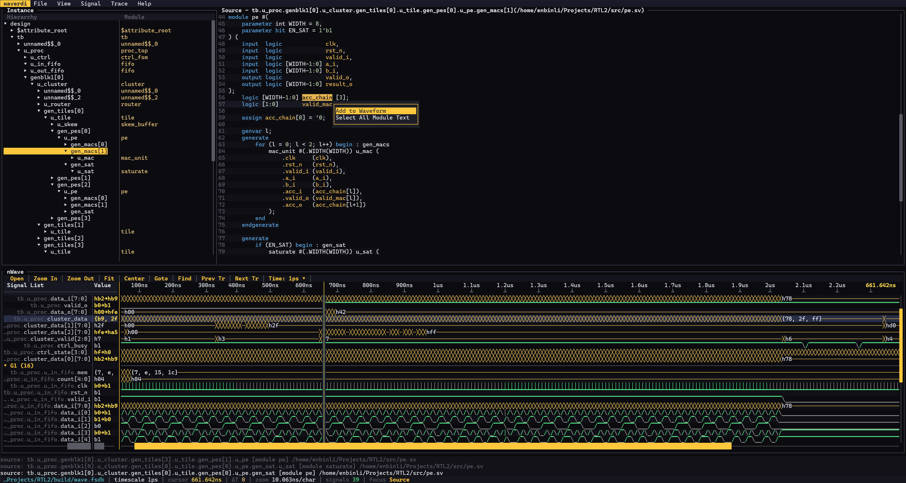

# waverdi

终端里的 Verdi 风格 RTL 波形查看器，使用 Rust 编写。

[English](README.md) | **简体中文**

waverdi 把日常 RTL 调试所需的层次、源码与波形集中在同一个 TUI 中，专为 SSH
会话和无图形环境设计：打开 VCD / FST / FSDB，浏览信号、RTL 源码与波形，全程
不用离开终端。



## 亮点

- **波形格式** — VCD、FST（[wellen](https://github.com/ekiwi/wellen)）、
  FSDB（Linux 上的 Verdi FFR SDK）。
- **Verdi 布局** — 顶部菜单栏，上方 `Instance | Source`，下方合并的 nWave
  窗口；所有面板边框与滚动条都可拖动。
- **RTL 源码调试** — 选中实例即可阅读高亮源码，通过 SystemVerilog AST 解析
  信号（generate 块、genvar、解包数组），并能从波形双击跳转到驱动它的逻辑。
- **多维数组** — 解包数组自动分组、以花括号值展示，并可逐维展开/折叠。
- **顺手导航** — vim 按键、多选、用户分组、查找/搜索、主题。

## 功能

- **VCD 解析** — scope、向量、`real`、`string`、`x`/`z`、全部进制
  （`b`、`o`、`h`、`d`、`r`、`s`）、`$dumpvars` 与 timescale。
- **FST 支持** — GTKWave 的 Fast Signal Trace 格式，通过
  [wellen](https://github.com/ekiwi/wellen) 读取。
- **FSDB 支持** — Linux 上设置 `VERDI_HOME` 指向 Verdi 安装后，经由
  `csrc/ffr_bridge.cpp` 直接调用 Synopsys FSDB Reader（FFR）读取 `.fsdb`；
  没有 SDK 时会提示如何启用或改用 `fsdb2vcd` 转换。
- **RTL 源码视图** — 显示所选实例模块的高亮源码、行号与键盘/鼠标光标
  （见 [RTL 源码](#rtl-源码)）。同一文件里的非活动模块代码会以暗色显示。
- **基于 AST 的信号解析** — 源码窗口理解声明、`generate for` 循环、
  `generate if` 分支、genvar 与实例链，因此 `count`、`dut.count`、
  `cluster_valid[i]`、`arr[i][j]` 都能解析到正确 scope；添加同文件其它模块的
  信号时会自动把 Instance 面板切换到所属实例。
- **波形绘制** — 细高/低电平线、`/` 上升沿与 `\` 下降沿（密集活动折叠为
  `│`）、总线内嵌数值，`real` 与逻辑信号的模拟波形。
- **解包数组** — dump 中逐元素存储（`mem[0][7:0]`…），自动归组到父信号；
  值以花括号文本显示 —— `{0, 1, 2, 3}`，多维则逐层嵌套
  `{{0, 1, 2}, {2, 3, 4}, {1, 2, 3}}` —— 默认十六进制。双击可逐维展开/折叠，
  数组设置的 radix 会作用于其元素。
- **Signal List 分组** — 默认 G0，右键菜单可新建/重命名/删除分组；分组边界在
  波形区以边框线标出。
- **信号操作** — radix（Hex/Binary/Octal/Decimal/ASCII）、数字 ⇄ 模拟波形、
  拆分总线为位、把多个信号拼成总线、值搜索（`v` 后 `n`/`N`）、标尺显示光标
  时间。
- **完整鼠标支持** — 菜单/工具栏点击、面板边框与滚动条拖动、拖拽排序信号与
  分组、框选缩放、滚轮缩放、右键上下文菜单。
- **主题与设置** — `F2` 打开设置对话框：`Dark` / `Light` / `Mixed`（浅色
  界面配深色波形）主题，并可逐项自定义波形颜色（电平、未知/高阻、总线、
  光标、模拟、刻度、背景）。
- **SSH 友好** — 检测到 SSH（或无显示环境）时自动跳过系统文件对话框，改用
  内置终端文件浏览器；也提供无 GUI 依赖的构建。

## 构建

唯一硬性要求是 Rust（stable，1.87+）。只有 Linux 上的可选 FSDB 支持需要 C++
工具链。克隆仓库后执行 `cargo build --release`，产物在 `target/release/`。

### Windows

1. 从 <https://rustup.rs> 安装 Rust（默认 MSVC 工具链还需要 Visual Studio
   Build Tools 的 *使用 C++ 的桌面开发* 组件）。
2. 构建：

```powershell
git clone https://github.com/SolidFaker/waverdi.git
cd waverdi
cargo build --release          # target\release\waverdi.exe
```

### Linux

1. 安装编译工具链、git 与 Rust：

```sh
# Debian / Ubuntu
sudo apt update && sudo apt install build-essential git
# Fedora / RHEL
sudo dnf install gcc-c++ make git
# Arch
sudo pacman -S base-devel git rust

curl --proto '=https' --tlsv1.2 -sSf https://sh.rustup.rs | sh
```

2. 构建：

```sh
git clone https://github.com/SolidFaker/waverdi.git
cd waverdi
cargo build --release          # target/release/waverdi
```

直接读取 `.fsdb` 还需要 Verdi 安装，见下文。

### macOS

1. 安装 Xcode 命令行工具与 Rust：

```sh
xcode-select --install
curl --proto '=https' --tlsv1.2 -sSf https://sh.rustup.rs | sh
```

2. 构建：

```sh
git clone https://github.com/SolidFaker/waverdi.git
cd waverdi
cargo build --release          # target/release/waverdi
```

FSDB Reader SDK 仅支持 Linux，因此在 macOS 上打开 `.fsdb` 会提示改用
`fsdb2vcd` 转换。

### 无图形 / 仅 SSH

程序总会回退到内置终端文件浏览器，也可以完全去掉可选的 `rfd` GUI 依赖：

```sh
cargo build --release --no-default-features
```

### FSDB（Linux + Verdi）

直接读取 FSDB 需要 Verdi 自带的专有 FSDB Reader SDK。构建前先 source
Synopsys 环境（设置 `VERDI_HOME`），然后正常编译：

```sh
source ~/synopsys/env.sh       # 设置 VERDI_HOME、VCS_HOME 等
cargo build --release
```

构建脚本会用 `$VERDI_HOME/share/FsdbReader/ffrAPI.h` 编译
`csrc/ffr_bridge.cpp` 并链接 `libnffr`/`libnsys`；没有 SDK 时仍是纯 Rust
构建，打开 `.fsdb` 会给出提示。测试套件包含与 Verdi `fsdb2vcd` 的交叉验证。

## 使用

```sh
waverdi waveform/counter.vcd                 # 打开 VCD
waverdi waveform/demo.fst                    # 打开 FST
waverdi wave.fsdb                            # 打开 FSDB（需 Verdi SDK 构建）
waverdi -f rtl.f wave.fsdb                   # 同时指定 RTL filelist
waverdi --list-signals waveform/complex.vcd  # 打印层次后退出
waverdi --no-gui waveform/counter.vcd        # 强制使用内置 TUI 文件浏览器
waverdi --gui waveform/counter.vcd           # 强制使用系统文件对话框
```

`waveform/` 目录内含示例：`counter.vcd`（带 enable/carry 的 4 位计数器）、
`complex.vcd`（含三态与模拟值的小型 CPU/RAM/sensor 设计，16 个信号）、
`demo.fst`（嵌套 tb/u_dut 设计）。

### RTL 源码

右上角的 **Source** 面板由 RTL filelist 提供：

- 命令行 `-f <filelist>`，可重复指定多个；
- 运行时 **File ▸ Load Filelist...** —— 与 **Open Waveform** 使用相同的
  文件对话框（或内置浏览器）。

filelist 使用 VCS 格式（`-f`/`-F` 嵌套、`-v`、`-y`、`+incdir+`、
`+define+`、`//` 注释）。未指定 filelist 而打开 FSDB 时，waverdi 会尝试从
dump 旁边的 Verdi KDB（`simv.daidir/debug_dump/src_files_verilog`）或
FSDB 内记录的 KDB 路径恢复源文件列表，最后回退到扫描 dump 目录中的
`.v`/`.sv` 文件。

解析使用轻量 SystemVerilog 扫描器：模块、端口与声明、`assign`、
`always`/`initial` 块、generate 块与实例化都保留文件与行号。**Instance**
面板仅列实例；选中后在 **Source** 面板打开其模块。面板标题同时给出实例与
文件（`Source - tb.u_proc.genblk1[0].u_cluster(.../cluster.sv)`）；原先显示
在代码上方/下方的实例、模块、文件以及信号 trace 信息改为写入消息日志。

从源码添加信号：

- 光标放在名字上按 `Enter` / `a`（双击也等于选中名字）；
- 鼠标拖拽或用 `Shift`+方向键选择文本，再按 `Ctrl+W` 或右键 ▸
  **Add to Waveform** 一次添加所选全部信号（同一次操作内去重；同一信号可以
  重复添加多次）；
- `Ctrl+A`（或右键 ▸ **Select All Module Text**）选中整个模块；
- 拖拽选区超出面板边缘时会自动滚动，方便继续选择。

信号引用通过设计 AST 解析，而不是文本匹配：

- 普通名字属于所选实例自身的模块；
- `dut.count` 沿实例层次向下查找；
- `cluster_valid[i]` / `data_chain[k]` 用所选 generate scope 的 genvar 求值，
  命中对应元素；
- `arr[i][j]` 按维度逐级解析多维数组；
- 选中同一文件中**其它模块**的标识符（该部分代码显示为暗色）时，Instance
  面板会自动切换到那个模块所属的实例并在该 scope 添加信号。

所选信号的声明 / 驱动 / 负载行会追加到消息日志。

### 文件对话框

**Open** 在有桌面环境时使用系统对话框；检测到 SSH（`SSH_CONNECTION`、
`SSH_CLIENT`、`SSH_TTY`）或既无 `DISPLAY` 也无 `WAYLAND_DISPLAY` 时自动
跳过，改用内置浏览器。可用 `--gui` / `--no-gui` 强制指定，或按 `O` 直接
打开内置浏览器。

## 按键

| 按键 | 功能 |
| --- | --- |
| `q`、`Ctrl+C/Q` | 退出 |
| `o` / `O` | 打开（系统对话框 / 内置 TUI 浏览器） |
| `:` | 跳转到时间（`1500`、`1.5us` …） |
| `g` | vim 前缀：`ge` 上一个下降沿、`gg` 第一行 |
| `G` | 跳到最后一行 |
| `s` | 搜索信号 |
| `v` | 在当前信号中查找值（对话框） |
| `n` / `N` | 下一个 / 上一个匹配值（循环） |
| `z` / `Z` | 以光标为中心放大 / 缩小 |
| `f` | 适配整个时间范围 |
| `c` | 光标居中 |
| `h` / `l` | 光标左 / 右移一列 |
| `0` / `$` | 跳到时间起点 / 终点 |
| `←` / `→` | 移动光标（按住 `Shift` 为 10 倍） |
| `j` / `k` | 下一 / 上一行 |
| `J` / `K` | 选中的信号（或分组）下 / 上移；多选时整块移动 |
| `V` | 可视模式：`j` / `k` 扩展多选 |
| `dd` | 剪切选中信号到寄存器 |
| `p` | 把寄存器粘贴到当前信号下方 / 当前分组 |
| `Space` | 切换该行是否在多选中 |
| `Shift`+`↑` / `↓` | Source：扩展文本选择；列表：扩展信号选择 |
| `Esc` | 清除多选 / 退出可视模式 |
| `w` / `b` | 下一个 / 上一个边沿（1 位信号：上升沿） |
| `e` / `ge` | 下一个 / 上一个下降沿（1 位信号；总线则跳变化） |
| `-` / `=` | 缩小 / 放大 |
| `,` / `.` | 上一个 / 下一个跳变 |
| `Home` / `End` | 跳到起点 / 终点 |
| `a`、`Enter` | Instance：展开/折叠 scope；Source：添加光标处信号；Signal List：展开/折叠分组 |
| `j` / `k` / `h` / `l`、方向键 | Source：移动代码光标 |
| `Shift`+`←` / `→` | Source：按字符扩展选择 |
| `Ctrl+W` | Source：把所选信号添加到波形 |
| `Ctrl+A` | Source：选中整个模块 |
| `←` / `→` | 在分组行上：折叠 / 展开 |
| `x` | 波形区：剪切选择（同 `dd`） |
| `r` | 循环 radix，或重命名所选分组 |
| `h` | Signal List：切换完整/简短层次名 |
| `↑` `↓`、`PgUp` `PgDn` | 列表导航 |
| `Tab` | 切换焦点（Instance → Source → Signal List → Waveform） |
| `F2` | 设置：主题（dark / light / mixed）与波形颜色 |
| `F1`、`?` | 按键帮助 |

## 鼠标

| 操作 | 效果 |
| --- | --- |
| 点击菜单 / 工具栏 | 执行 |
| 拖动面板边框 | 调整面板尺寸（Instance ∣ Source、上方 ∣ nWave、Signal List 宽度、Value 列、Hierarchy ∣ Module） |
| 拖动底行滚动条 | 横向滚动（Source、Instance 两列、Signal List 名称与 Value） |
| 拖动侧边滚动条 | 纵向滚动（Instance、Source、Signal List） |
| 拖动 Signal List 行 | 排序信号（多选时整块移动） |
| 拖动分组标题 | 调整分组顺序 |
| 点击标尺 / 在波形上拖动 | 设置光标 / 选择时间范围 |
| 在已选范围内点击 | 缩放到该范围 |
| 滚轮（波形上） | 以指针为中心缩放（列表上为滚动） |
| `Shift`+滚轮 | 平移 |
| 中键点击 | 缩小 |
| 右键信号 / 分组 / 源码 | 上下文菜单（radix、波形、总线子菜单） |
| `Shift`/`Alt`+点击信号 | 加入 / 移出多选 |
| `Ctrl`+点击信号 | 选中锚点与点击处之间的所有信号 |
| 双击信号名 | 展开 / 折叠其位或下一维数组 |
| 双击波形 | 跳转到驱动该信号的逻辑（Source + Instance） |
| 双击分组 | 折叠 / 展开（`r` 或右键菜单重命名） |
| 双击 | Instance 面板中展开/折叠实例 |
| Source 单击 / 双击 / 拖拽 | 移动代码光标 / 选取信号名 / 选择文本（到边缘自动滚动） |
| 对话框 `✕` / 滚动条 | 关闭对话框 / 拖动滚动条 |
| 快捷栏 Time 按钮 | 循环标尺时间基准（timescale → fs … s） |

> Windows Terminal 会把 `Shift`+点击保留给文本选择，不会传给程序；在该终端
> 请使用键盘 `V` / `Space` / `Shift`+`↑`/`↓`（或 `Alt`+点击）进行多选。

`dd`、`r`（radix / 重命名）、右键 radix 以及波形模式在被点击信号属于多选时
作用于整个多选。状态栏显示选择数量、可视模式与寄存器大小。

## Signal List、分组与数组

信号以**叶子名**右对齐显示，长名字优先保留尾部；开启完整层次名（`h`）时
前缀以暗色绘制，整列可横向滚动（Value 列有独立的横向滚动条）；两列之间的
分隔线贯穿到面板底部。

列表按**用户分组**组织而非设计层次：默认存在 `G0`，添加信号进入光标所在
分组；信号落入（或移动到）最新分组后会自动追加一个空分组。分组编号始终从
现有最大编号继续（`G0 G1 G2 G3 G4`，删除 `G3` 后下一个是 `G5`；删除 `G5`
则会复用）。用 `r` 或右键菜单重命名只改标签、不改编号。`J`/`K`（或拖拽）
让信号跨分组移动 —— 落入哪个分组就归属哪个；在分组行上按 `J`/`K` 则移动
整个分组。鼠标拖拽只在**放下**时创建末尾空分组，拖过列表不会留下一串空
分组。

**解包数组**在 dump 中逐元素存储（`mem[0][7:0]` 等），会自动归组到父信号。
父信号以花括号文本显示数组值 —— `{0, 1, 2, 3}`，多维为
`{{0, 1, 2}, {2, 3, 4}, {1, 2, 3}}` —— 默认十六进制。双击信号展开其位或
数组的一维，折叠时移除该节点下的整棵子树。数组设置的 radix 会应用到元素。

## 上下文菜单

上下文菜单只显示菜单项（无顶部标题），选中项整行高亮。内容包括：

- **Set Radix** ▸ Hex / Binary / Octal / Decimal / ASCII
- **Set Waveform** ▸ Digital / Analog
- **Bus Operations** ▸ Split Bus（弹出宽度输入，`data` → `data[0]`…`data[n]`）、
  Create Bus（为当前所选信号打开排序窗口；任意位宽，首行为 MSB）
- **Remove Signal**
- 分组上：New Group / Rename / Expand / Collapse / Expand All /
  Collapse All / Remove Group
- Source 面板上：**Add to Waveform** / **Select All Module Text**

Create Bus 窗口内：`↑`/`↓` 选择、`Shift`+`↑`/`↓` 调序、`h`/`l` 调整 LSB、
`H`/`L` 调整 MSB、`x` 恢复完整位宽（例如
`{sig1[4:3], sig2[0], sig4[66:43]}`）、`s`/`S` 按名字升/降序、`r` 反转、
`Enter` 创建、`Esc` 取消。

## 设置

`F2`（或 **View ▸ Settings...**）打开设置对话框：

- **Theme** — `Dark`、`Light` 或 `Mixed`。Mixed 下波形区保持深色、其余窗口
  为浅色；波形背景是独立设置，与界面背景互不影响。
- **UI colours** — 各窗口共用的背景色。
- **Waveform colours** — 波形自己的背景（`background (wave)`）、高/低电平、
  未知（x）、高阻（z）、总线值与文本、光标、模拟、时间刻度。`←`/`→` 循环
  内置调色板，`Enter` 前进，`r` 恢复主题默认。

切换主题会重置逐项自定义颜色；设置在本次会话内有效。

## 项目结构

```
csrc/              ffr_bridge.cpp —— FSDB Reader (FFR) C++ 桥接
build.rs           探测 VERDI_HOME / FSDB SDK 并编译桥接
waveform/          示例 dump（counter.vcd、complex.vcd、demo.fst）
shot/              README 截图
src/
├── main.rs        CLI、终端初始化、事件循环
├── app/           状态机：输入、按键、鼠标、视图、导航、动作
├── ui/            ratatui 渲染：layout、tree、source、list、wave、菜单
├── rtl/           RTL 源码：filelist/KDB 发现、SV 扫描器、源码视图
├── waveform/      数据模型：信号、值、时间、scope 树、数组
├── vcd.rs         VCD 解析器
├── fst.rs         FST 加载（wellen）
├── fsdb.rs        FSDB 加载（Verdi FFR SDK，Linux）
├── dump.rs        格式探测与分发
├── picker.rs      系统对话框探测 / 封装
└── theme.rs       颜色主题
```

## 开发

```sh
cargo test                       # 单元测试 + UI 渲染测试
cargo test fsdb                  # FSDB 测试（需要 VERDI_HOME，交叉验证 fsdb2vcd）
cargo test --no-default-features # 纯 TUI 构建
cargo clippy --all-targets
cargo fmt --check
```
